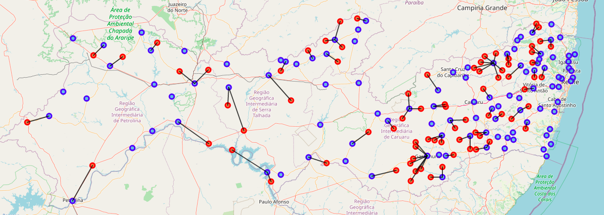

<h1 style="text-align: center;">Brazilian COVID-19 Healthcare Workers Vaccination Logistics¶</h1>
<h2 style="text-align: center;">Henrique Siqueira - December 20, 2020</h2>

### 1. Introduction

### 1.1 COVID-19 in Brazil
The COVID-19 pandemic, also known as the coronavirus pandemic, is an ongoing pandemic caused by severe acute respiratory syndrome coronavirus 2 (SARS-CoV-2). 
When this notebook was written, more than 180 thousand people had lost their lives to COVID-19 in Brazil. As of December 15th, 2020, Brazil had not detailed its coronavirus immunization plan and [did little to assuage concerns that the government is stumbling in its efforts to inoculate 212 million people, with no timeline and vague supply agreements.](https://www.bloomberg.com/news/articles/2020-12-14/brazil-s-vaccination-plan-elicits-more-questions-than-answers)

Brazil occupies half the continent's landmass. [It is the fifth largest country in the world, with an area greater than that of the 48 conterminous U.S. states.](https://www.britannica.com/place/Brazil) Brazil stretches roughly 2,700 miles (4,350 km) from north to south and from east to west to form a vast irregular triangle that encompasses a wide range of tropical and subtropical landscapes, including wetlands, savannas, plateaus, and low mountains. With such a continental country, the healthcare coverage and distribution is highly irregular.

Concentrated in the largest cities and most developed regions, there are few hospitals and beds in the poorer regions. [In fact, patients from 43% of the country's cities will need to travel if they have serious Covid-19 symptoms](https://oglobo.globo.com/sociedade/coronavirus-menos-de-um-quarto-dos-municipios-brasileiros-tem-leitos-de-uti-que-atendem-pelo-sus-24353614). This is because only 53.1% of the 5,570 Brazilian municipalities have hospitals with hospitalization beds by the public system - in general, they are larger cities, elected as regional health centers to meet the demand of all patients.

### 1.2 Healthcare workers
Frontline health and social care workers [are at increased personal risk of exposure to infection with COVID-19](https://www.thelancet.com/journals/lanpub/article/PIIS2468-2667%2820%2930164-X/fulltext) and of transmitting that infection to susceptible and vulnerable patients in health and social care settings.

In December 2020, the United Kingdom was the first country in the world to roll out the Pfizer-BioNTech COVID-19 Vaccine for emergency use. The UK committee [considered frontline health and social care workers who provide care to vulnerable people a high priority for vaccination](https://www.gov.uk/government/publications/priority-groups-for-coronavirus-covid-19-vaccination-advice-from-the-jcvi-2-december-2020/priority-groups-for-coronavirus-covid-19-vaccination-advice-from-the-jcvi-2-december-2020). This prioritisation was taken into account during vaccine deployment.

In Brazil, unlike hospitalization beds, the healthcare workforce is more evenly distributed among all states, in thousands of municipalities. They work mainly in healthcare centres, including clinics, doctor's offices, etc. Not all of them are located in cities with available hospitals.

### 1.3 Problem and interest

This project aims to use *Foursquare location data* combined with the *number of healthcare workers by municipality* and *GPS data* to suggest **the closest cities with hospitals that could be used as vaccination centers for those professionals** and, because they are one of the first groups to receive the vaccine, for treatment in cases of anaphylactoid reaction or other complications. This notebook will also display a dataframe with the number of people that would be immunized in each city to help with transportation and logistics.

This information is interesting for the general population that want to know more about how the vaccination may proceed, for the healthcare workers in cities without hospitals that would like to know about possible vaccination centers and for the Ministry of Health professionals.

### 1.4 Disclaimer
This information was created as part of a Data Science course. It is publicly available, as required, but for academic purposes only and must not be used to make actual decisions. The COVID-19 pandemic is a serious matter and lives are at stake. In particular, the Foursquare data may not be accurate (although its use was mandatory for this activity) and a lot of simplifications were taken in this **learning exercise**, including but not limited to the fact that we are mapping hospitals instead of using the more than [36,000 vaccination rooms](https://www.scielo.br/pdf/ress/v28n2/en_2237-9622-ress-28-02-e20190223.pdf) in Brazil. For actual vaccine deployment plans, please refer to the Brazilian [Ministry of Health](https://www.gov.br/saude/pt-br).

### 2. Data
#### 2.1 Data sources

The [National Registry of Health Facilities (CNES)](http://www2.datasus.gov.br/DATASUS/index.php?area=0204&id=11673) is the official information system for registering information on all health establishments in Brazil, regardless of their legal nature or whether they are part of the Unified Health System (SUS). This is the official record of the Brazilian Ministry of Health regarding the healthcare workforce in Brazil, in public and private health establishments. In this project, we used this datasource to find the number of healthcare workers by municipality.

The [Municípios Brasileiros](https://github.com/kelvins/Municipios-Brasileiros) (In portuguese) - was used as the datasource for the 5,570 brazilian municipalities, with the latitude and longitude of the city centers.

Finally, the [Foursquare API](https://developer.foursquare.com/developer/) was used to count the number of hospitals within 5 km of the city center (ie. find cities with hospitals) based on the above mentioned geographical coordinates.

#### 2.2 Data cleaning

Data downloaded or scraped from multiple sources were combined into tables using Pandas. Columns in portuguese were translated to english, information and counts specific to each profession/occupation (nurses, medics, etc) was dropped and only the total number of healthcare workers by municipality was used.

Unfortunately, API calls to Foursquare are limited and reading information from all Brazilian cities would take a long time. As such, the evaluation scope was reduced to the cities in a single Brazilian state, Pernambuco. All data that was not related to this state was removed.

### 3. Methodology
#### 3.1 Procedures

In first step we have collected the required data: **location and number of healthcare workers for each municipality**. We have also **identified the number of hospitals by municipality** (according to Foursquare information) and cleaned the data to make it easier to use.

Second step in our analysis was the exploration of hospital and healthcare workers across different municipalities, then we focused our attention in the **cities without hospitals**.

In the third and final step, to accurately calculate distances, we also created a grid of locations in the Cartesian 2D coordinate system, which allows us to calculate distances in meters (not in latitude/longitude degrees). Using this information we identified the nearest hospital for the healthcare workers that are in those municipalities and **calculated the number of healthcare workers that could be vaccinated in each municipality**.

#### 3.2 Exploratory Data Analysis

In the data analysis section, we have evaluated the distribution of the number of hospitals and the distribution of healthcare workers. There are 107,811 healthcare workers distributed among 185 municipalities in Pernambuco. Figure 1 shows the distribution of the number of workers by municipality:

Figure 1. Distribution of workers by municipality

On average, there are 106 healthcare workers in each municipality distributed among all municipalities. In fact, we can see from our data that the smallest city has 30 healthcare workers and Recife, the biggest city and capital of the state, has 47,065 healthcare workers. That’s the outliner in figure 1 above. Figure 2, below, is a heatmap showing that there are workers in the whole state, but most are located near the coastline.

Figure 2. Heatmap with the distribution of healthcare workers.

Figure 3 shows the distribution of the number of hospitals by municipality. As before, we can see that one city that has significantly more hospitals than the rest of the state. That's Recife again, with 143 hospitals within 5km of the city center. 

Figure 3. Distribution of hospitals by municipality

On average, most cities have a single hospital. At the lower extreme, unlike with the number of healthcare workers, there are 77 municipalities (41.6% of the total) without a single nearby hospital, as shown on the map below, in red:

Figure 4. Map with the municipalities of Pernambuco. Red dots are cities without a nearby hospital.

### 4. Results: Healthcare worker vaccination
#### 4.1 Travels

Based on the analysis above, it is possible to see that not all municipalities have hospitals nearby. As such, below is a suggestion with **the closest cities with hospitals that could be used as vaccination centers for those professionals** and, because they are one of the first groups to receive the vaccine, for treatment in cases of anaphylactoid reaction or other complications . 

Figure 5. Map with the municipalities of Pernambuco. Cities without a nearby hospital (in red) are connected to the nearest city with a hospital (in blue).

To calculate those routes, we created an algorithm to get the [Euclidean distance](https://en.wikipedia.org/wiki/Euclidean_distance) between two cities in the same UTM zone, extended our dataframes with this information and then connected the closest cities.

#### 4.2 Vaccine numbers

After those changes, each municipality should, on average, vaccinate 253 healthcare workers. The boxplot below illustrates the distribution of the number of vaccines that should be sent for each municipality

Figure 6. Boxplot showing the distribution of workers to vaccinate in each municipality

Finally, the number of vaccines that should be sent to each municipality is available in this [link](../brazilian_hospitals.ipynb).

### 5. Discussion

Our analysis shows that, although there are 107,811 healthcare workers to be vaccinated distributed among 185 municipalities in the state of Pernambuco, Brazil, almost half of those municipalities (41.6%) do not have any hospitals nearby. In fact, 7,343 healthcare workers are located in cities without hospitals. Based on these numbers, we can see that the vaccination logistics will be a challenge. Our recommendation was to use the 107 municipalities that have a hospital near the city center to vaccinate all those healthcare workers. We implemented an algorithm to distribute those workers and plotted a map and created a table with the number of vaccines that should be sent to each municipality.

### 6. Conclusion

Purpose of this project was to identify the healthcare workers that are located in cities without hospitals and to suggest the closest hospitals that could be used as vaccination centers for those professionals. We also displayed a dataframe with the number of people that would be immunized in each city to help with transportation and logistics.

Because COVID-19 is a serious matter and lives are at stake, final decisions on optimal vaccination locations should be made by the Health Ministry taking into consideration additional factors that were not covered by this exercise.